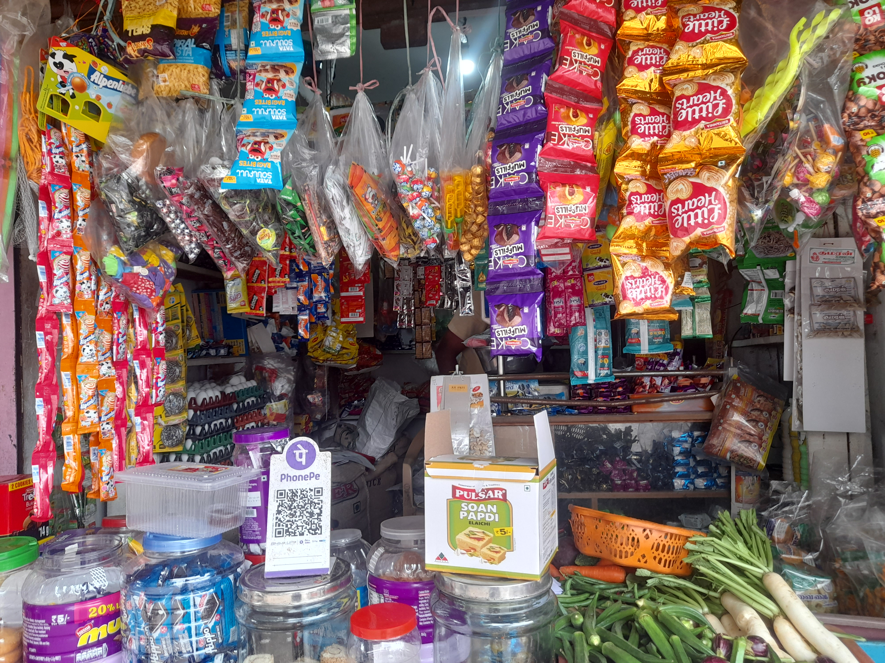

# 🛒 Chinnadurai Stores - Online Grocery Landing Page

Welcome to the official website source code of **Chinnadurai Stores**, a local grocery store located in Kalveerampalayam, Coimbatore. This responsive landing page is built using **Vue 3** and **Tailwind CSS**, with multilingual support for **English and Tamil**.

## 🌐 Live

click here to visit the live site : [Chinnadurai Stores](https://chinnadurai-stores.vercel.app/)

## 📸 Preview



## ✨ Features

- 🌐 Multilingual Support (English 🇬🇧 / Tamil 🇮🇳)
- 📱 Mobile-first, responsive design
- 💬 Interactive chatbot
- 📦 Hero section, product slider, reviews, and contact map
- 🗺️ Embedded Google Map for store location
- 🥬 Grocery & fresh produce image carousel
- ☀️ All white icons optimized for dark-mode devices
- 🖱️ Auto-close menu on navigation click (mobile UX improved)

## 🛠️ Tech Stack

- [Vue 3 (Composition API)](https://vuejs.org/)
- [Vite](https://vitejs.dev/)
- [Tailwind CSS](https://tailwindcss.com/)
- [Ngrok](https://ngrok.com/) — for mobile device testing

## 🚀 Getting Started

### 1. Clone the Repository

```bash
git clone https://github.com/your-username/chinnadurai-stores.git
cd chinnadurai-stores
```

### 2. Install Dependencies

```bash
npm install
```

### 3. Start the Development Server

```bash
npm run dev
```

### 4. Open in Browser

Open your browser and navigate to `http://localhost:5173` (or the port specified in the terminal).

### 5. Mobile Testing

For mobile testing, use [Ngrok](https://ngrok.com/) to expose your local server to the internet:

```bash
ngrok http 5173
```

This will provide you with a public URL that you can open on your mobile device.

## Folders Structure

```
src/
├── assets/               # Static images
├── components/           # Hero.vue, WhyUs.vue, Reviews.vue, etc.
├── App.vue               # Main layout and logic
├── main.js               # App entry point
└── index.html            # Root HTML template
```

## 🧠 Usage Notes

- Toggle between Tamil/English from the navbar.

- Chatbot responds with preset logic (can be expanded later).

- All navigation auto-closes the hamburger menu on mobile.

- Tailored for real Tamil display with proper alignment and font sizing.

## 🙏 Credits

Developed by Nitheesh,
for Chinnadurai Stores – Grocery shop in Kalveerampalayam, Coimbatore.
